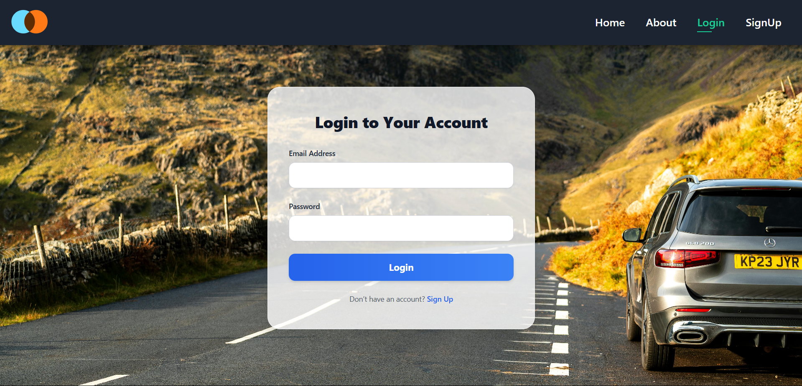
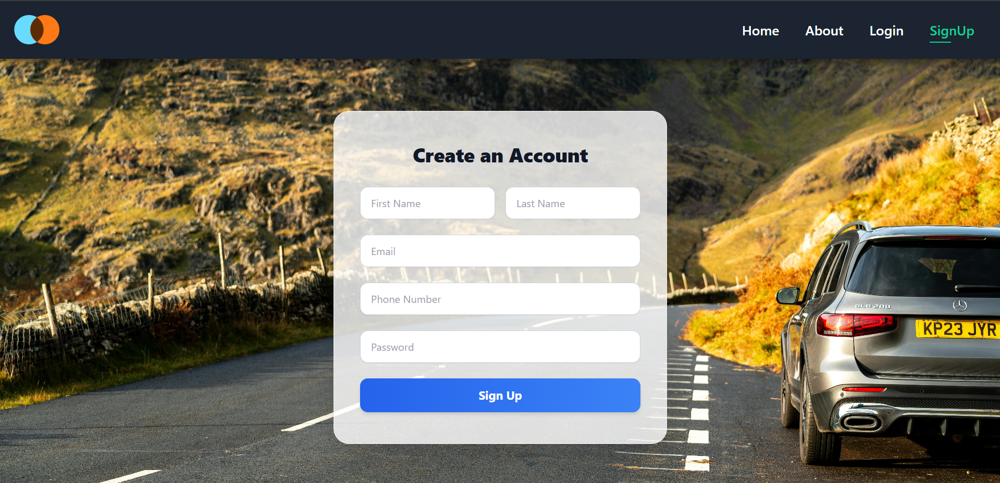
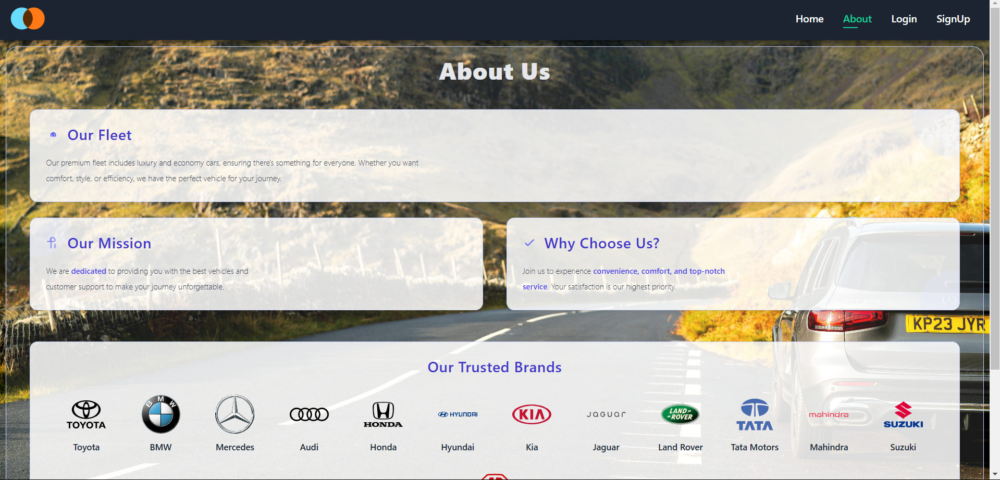
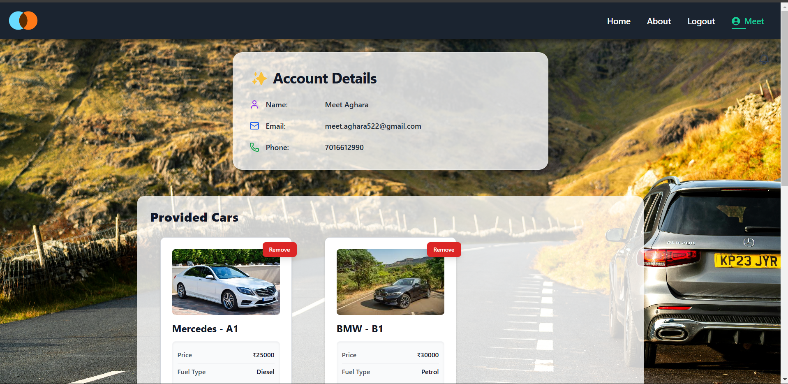
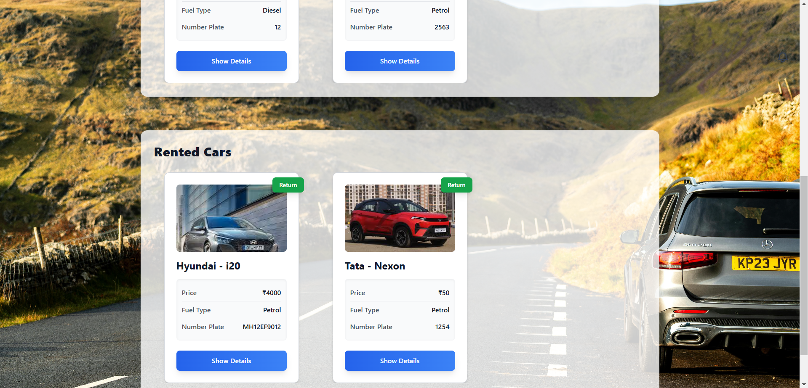
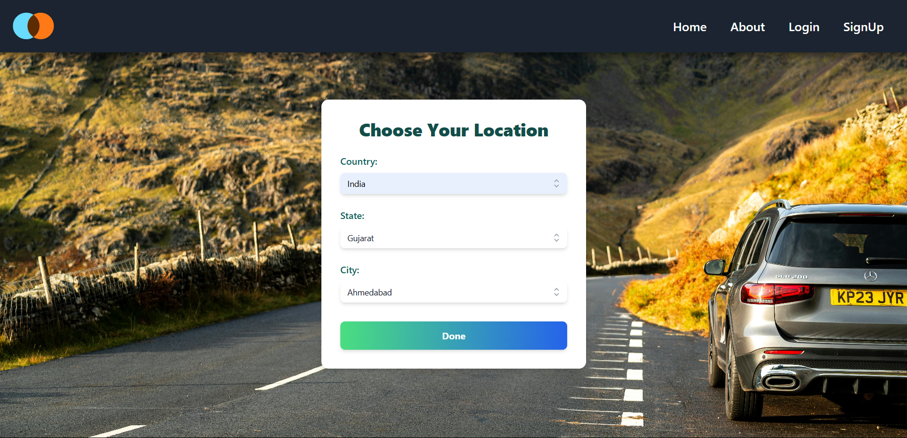
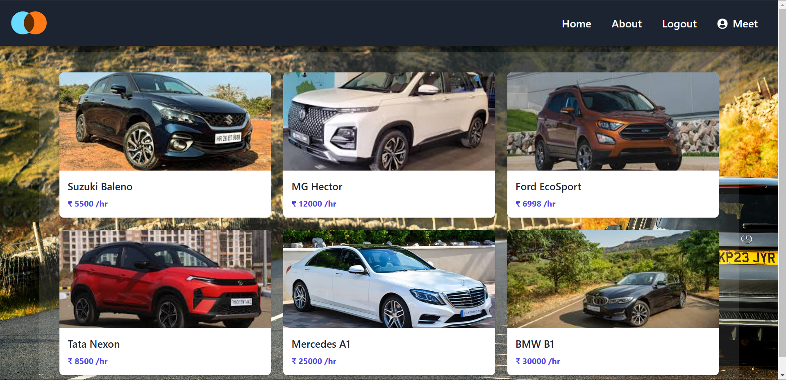
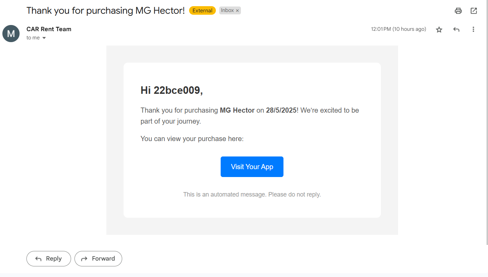

# 🚗 DriveMyWay: Your Personal Car Rental Companion

Tired of complicated booking systems and unreliable rental services? **DriveMyWay** is your all-in-one solution for smooth, fast, and flexible car rentals. Whether you're planning a weekend getaway or need a ride for business, DriveMyWay helps you find, book, and manage car rentals with ease.

---

## 🔥 Key Features – Why Choose DriveMyWay?

🚘 **Browse & Book Cars Easily**  
Find the perfect ride from a wide range of vehicles with detailed listings, images, and pricing.

📆 **Real-Time Availability**  
Check and book cars based on their current availability and location.

🔐 **JWT-Based Authentication**  
Secure login/signup system using JSON Web Tokens for user session management.

📩 **Email Notifications to Customers**  
Receive confirmation emails with car details once your booking is complete.

📥 **In-App Notifications for Owners**  
Car owners are instantly notified within their dashboard when their car is booked.

☁️ **Cloudinary-Powered Image Storage**  
Car images and assets are stored in Cloudinary for optimized loading and delivery.

⭐ **Ratings & Reviews**  
Leave and read reviews to help others choose the best ride.

📊 **Admin Dashboard Analytics**  
Admins can view platform statistics like bookings,  and user activity.

---

## 🧠 How DriveMyWay Works – Under the Hood

🔧 **Frontend** – Built with **React.js** + **Tailwind CSS** for a responsive and dynamic interface.  
🚀 **Backend** – Developed using **Node.js** and **Express.js** for efficient handling of APIs and logic.  
💾 **Database** – **MongoDB** stores user data, bookings, cars, and transactions securely.  
🖼 **Image Handling** – Images are uploaded and served via **Cloudinary** for high performance.  
🔐 **Authentication** – JWT is used to secure user sessions and route access.  
📩 **Emails to Renters** – Booking confirmation and car details sent to customers.  
🔔 **Dashboard Notifications for Owners** – Owners get real-time updates on car bookings directly in their account.

---

## ⚡ Quick Start – Rent a Car in 5 Easy Steps

1. 📲 **Register/Login**: Create your account as a customer or owner.
2. 🚘 **Browse Cars**: Filter by location, price, or car type.
3. 📆 **Pick Dates**: Select pickup and return dates.
4. 💳 **Make Payment**: Pay securely through integrated gateways. (Remaining)
5. 📩 **Get Notified**: Renter receives an email + Owner sees booking notification on dashboard.

---

## 📸 Snapshots – DriveMyWay in Action!

### 🏠 Home Page


### 🔐 Login Page


### 📝 Register Page


### ℹ️ About Page


### 👤 Account - DashBoard




### 🔍 Filter Cars Page


### 📋 Car Listings


### 📝 Rent a Car Form


### 📝 Mail 



---
## 🚀 Getting Started – How to Run DriveMyWay Locally
1. **Clone the repository:**

```bash
git clone https://github.com/MeetAghara512/DriveMyWay-Car-Rental-Web.git
cd DriveMyWay
```
2. **Install & Start backend dependencies:**
```bash
cd backend
npm install
nodemon index.js
```
3. **Install & Start frontend dependencies:**
```bash
cd ../frontend
npm install
npm run start
```
4. **Mongo Connect & cloudinary Database Connect**
---

## 🚀 Future Enhancements – Coming Soon

🧠 **AI-Based Road Recommendation**  
Suggest whether a car is more suitable for city roads or highways based on fuel efficiency and vehicle type.

📷 **Photo Upload Before & After Rental**  
Users will upload car photos before renting and after return. AI will analyze images to detect damage and estimate rough repair costs (interior damage assessment under R&D).

⭐ **Ratings via QR Code**  
Renters will scan a QR code to submit ratings. Cars with better ratings will appear higher in search results.

🧍‍♂️🚘 **With/Without Driver Option**  
Offer flexibility for users to choose whether to rent a car with or without a driver.

🪪 **KYC Verification via Aadhar & Driving License**  
User authentication will be enhanced using verified government IDs for extra security.

🛠 **In-App Car Service Tracking for Owners**  
Enable owners to monitor their vehicle’s health and servicing schedule.

---

> 🌟 **DriveMyWay** –  Your Journey Starts Here. 🚘🛣️ , Own the Road Without Owning the Car. 🛣️🔑.
